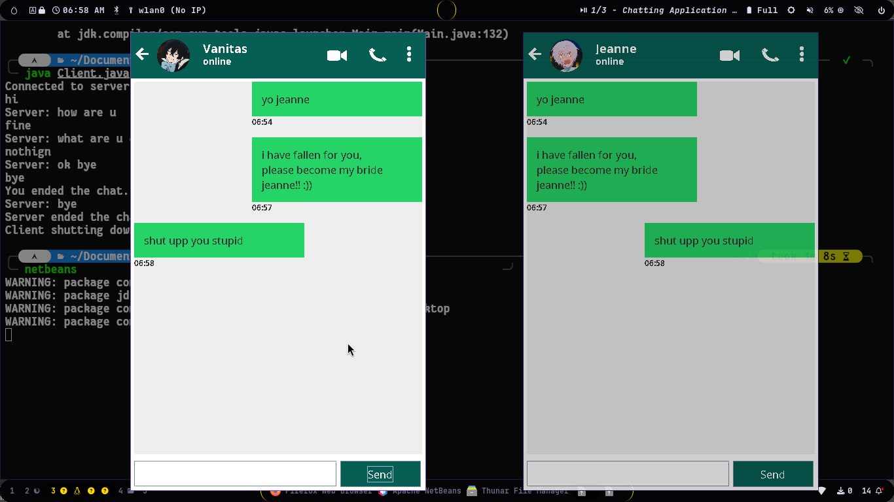

# Poketto 💬  

A simple **desktop-based chat application** built using **Java, Swing, AWT, and Socket Programming**.  
This project demonstrates how client-server communication works in Java using sockets, while also providing a clean GUI.  

---

## 🚀 Features
- Real-time messaging between client and server  
- GUI built with Swing & AWT  
- Easy to set up and run  
- Lightweight and beginner-friendly  

---

## 🛠️ Tech Stack
- **Java**  
- **Swing** (for GUI)  
- **AWT** (for components)  
- **Socket Programming** (for communication)  

---

## 📦 Installation & Usage
1. Clone the repository:  
   ```bash
   git clone https://github.com/Asnan07/Poketto.git
2.	Open in your IDE (e.g., IntelliJ, Eclipse, or VS Code with Java extensions).
3.	Run the Server.java file first.
4.	Run the Client.java file(s) to connect and start chatting.

##  🖼️ Screenshots

## 📚 Learning Goals
  • Understanding socket programming
	
  •	Building GUIs with Swing & AWT
	
  •	Learning how client-server apps exchange data

## 👤 Author
Asnan
	•	GitHub: @Asnan07
	
 • LinkedIn: http://linkedin.com/in/asn-zsh

⭐ If you found this project useful, don’t forget to star the repo!

